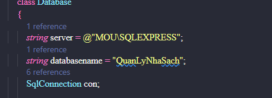

<h1 align="center"> BaoBei Bookstore Management</h1>  

  

  Management is easy when using BaoBei.

## Table of Contents

- [Table of Contents](#table-of-contents)
- [Introduction](#introduction)
- [Technologies](#technologies)
- [Setup](#setup)
- [Features](#features)
- [Build Process](#build-process)
- [Acknowledgments](#acknowledgments)
- [Evolution](#evolution)
- [Contact](#contact)

## Introduction
### This is a desktop application built **Winform C#** and **Devexpress version 21.2 Library** that provides the main function you'd expect from bookstore management such as CRM, HRM, etc. 
## Technologies
### Project create with:
- Winform C#
- Devexpress version 21.2
- SQL 

## Setup
1. Download and setup SQL Server 2017 [Link download SQL Server](https://www.microsoft.com/en-us/download/confirmation.aspx?id=56128)
2. Download and setup Visual Studio 2017 or higher.
[Link Download Visual Studio](https://visualstudio.microsoft.com/downloads/)
3. Download and setup Devexpress [Link Download Devexpress](https://drive.google.com/file/d/1ZBw0yQuZo4KTdcW4Izpe_8IqjOfPrdNO/view?usp=sharing)
4. Run sql script  
5. Change server name in file Database.cs at path QuanLyNhaSach_291021/Model/Database.cs
   
   

## Features
***BFD***

- Employee Manage
- Customer Manage
- Sale Manage
- Stock Manage
- etc

You can read more analysis document in [[Design Analysis Document](https://drive.google.com/file/d/1P4P9massqcuwI2Zq9I-iMLa0ckNwn9yk/view?usp=sharing)]

**Review Feature**
- Login Form

   |UserName | Pass    |  Role      |
   | :------ | :------ | :-------- |
   | admin1 | admin1 | Management |
   | user1  | user1  | Sale |
   | sudo  | sudo  | Administrator |

- Dashboard

- Product List

- Product Adding Form

- Revenue statistics

You can read more review user interface in [[Design Analysis Document](https://drive.google.com/file/d/1P4P9massqcuwI2Zq9I-iMLa0ckNwn9yk/view?usp=sharing)](From page 122)
## Build Process
This is my university subject project. I applied the waterfall process to my team. Some activity in every stage 
1. Requirements analysis
   - We have collected requests from teachers, then pose problems and analyze them.
2. System design
   - During this stage, I assigned task and supported the team members. But I also perform analysis of complex functions such as decentralization, sales management, import management.
3. Implementation
   - I chose Winform and Devexpress library. For the database part, I decided to use sql server. Then I did it by myself because want to master winform and devexpress library.
## Acknowledgments
- Benefits
   - Intuitive and simple design.
  - Usability feature

- Drawbacks
    - The functions are not really complete.
    - Haven't used all the security features of SQLServer.
    - Unoptimized code
## Evolution
- Complete the missing functions.
- More functionality and cross-platform build.
- Optimize code and apply additional security measures.
- Build more test scenarios.
## Contact

- ***Phone***: 0909300146
- ***Mail***: npminhquan1506@gmail.com
